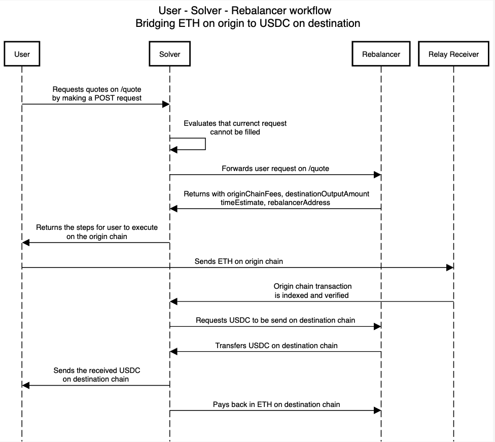

# Rebalancer 🔄

The **Rebalancer** facilitates the **Rebalancing** workflow, enabling secure and efficient execution of rebalancing operations for solvers that might not have liquidity to fill orders themselves.

# 🚧 Work in Progress 🚧

> ⚠️ This project is currently under active development and is not production-ready. Please refer to the [CONTRIBUTING.md](./CONTRIBUTING.md) for more information on how to contribute to the project. Any architectural changes are also welcome and can be discussed by opening an issue.

---

## **Rebalancing Workflow** 🔄

The Rebalancing workflow operates as follows:



---

## **Installation and Setup** 🛠️

First setup the environment variables by creating a `.env` file in the root directory. The `.env` file should contain the following variables:

```
# Mapping of chain ids to RPC URLs that will be used to load balance requests between them in a round robin fashion
# The first RPC in the array is used to estimate gas and fetching the gas price
RPC_URLS={"1": [], "10": []}

# Private key of the rebalancer wallet
REBALANCER_PRIVATE_KEY=

# Markup over the fees to be added to the fees
MARK_UP==

# Redis URL
REDIS_URL=

# CoinGecko API Key
COIN_GECKO_API_KEY=
```

Now you can install the dependencies and run the project using the following commands:

### Using Docker Compose

Navigate to the root directory and run the following command:

```
docker compose up
```

### Using Yarn

```
yarn install
yarn run build
yarn run start
```

## **Overview** 📖

The entire project is built using modular packages. The packages are as follows:

- **Server**: The server is the entry point for the application. It sets up the express server along with the necessary middlewares and routes.
- **Api**: The api is the collection of all the routes for the application. It currently has `/quote` and `/settle`
  routes, that are used to get quotes and settle orders respectively.
- **Services**: The services are the core of the application. They are responsible for the business logic of the application. There are 3 services:
  - **Quote Service**: The quote service is responsible for getting quotes for the orders and is used by the `/quote` route.
  - **Transaction Service**: The transaction service is responsible for getting the transaction details for the orders and is used by the `/settle` route.
  - **Price Feed Service**: The price feed service is responsible for getting the price feed for the orders and is
    used in the other two services.
- **Database**: The database is used to store requests received from the `/quote` route to be used in the `/settle` route. Currently the database is a Redis instance.
- **Types**: The types are the typescript types that are used throughout the application.
- **Utils**: The utils are the utility functions that are used throughout the application.

## Supported Chains 🔗

The project currently supports the following chains:

- Optimism
- Arbitrum
- Base Sepolia
- Sepolia
